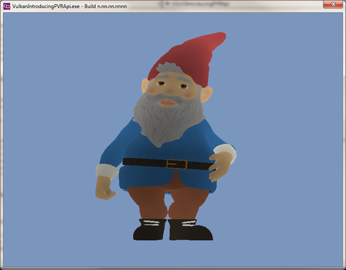
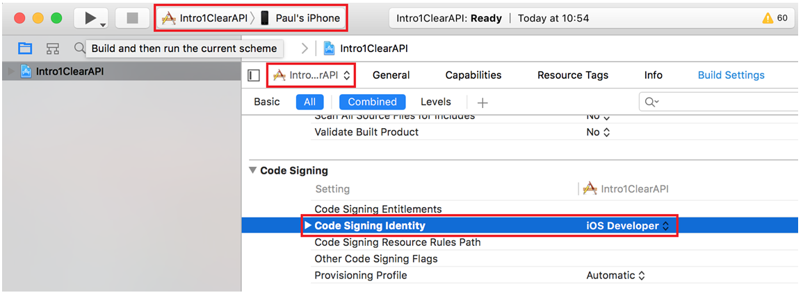

#PVRApiIntro
 


A set of examples introducing the PowerVR Framework including CMake files to target Windows, Linux, Android, iOS and OSX - both for Vulkan and OpenGL ES with one source file.

The CMake files also provide a useful base for writing new cross-platform cross-api applications.


##Fetch instructions
```
git clone https://github.com/PaulSobekIMG/PVRApiIntro.git
git submodule init
git submodule update
```

##Build Instructions

Pass ```-DAPI=OGLES|Vulkan``` to CMake to choose between Vulkan and OpenGL ES back ends

Windows, Linux and OSX OpenGL ES builds require the PowerVR VFrame libraries - [https://community.imgtec.com/developers/powervr/tools/pvrvframe/](https://community.imgtec.com/developers/powervr/tools/pvrvframe/ "PowerVR VFrame").

###Linux
```
cmake -DAPI=OGLES /path/to/PVRApiIntro/Intro1ClearApi/
cmake --build .
LD_LIBRARY_PATH=/path/to/PVRVFrame/Linux_x86_32/ ./Intro1ClearApi
```

###Windows
```
cmake -DAPI=OGLES /path/to/PVRApiIntro/Intro1ClearApi/
cmake --build .
```
Running OpenGL ES the application requires the PVRVFrame libraries to either be on your PATH environment variable or to be copied into the binary directory. 

###OSX
```
cmake -DAPI=OGLES /path/to/PVRApiIntro/Intro1ClearApi/
cmake --build .
open Intro1ClearAPI.app/
```

###Android
```
cmake -DAPI=OGLES -DANDROID_ABIS=armeabi-v7a -DANDROID_NDK=\path\to\android-ndk-r11c-windows-x86_64\android-ndk-r11c -DCMAKE_BUILD_TYPE=Debug -DANDROID_NATIVE_API_LEVEL="19" -DDEMO_SRC_DIR=C:\Path\To\PVRApiIntro\Intro1ClearAPI\ -DANDROID_SDK=C:\Users\path\to\AppData\Local\Android\sdk \path\to\PVRApiIntro\Dependencies\apk_maker\
cmake --build .
adb install -r bin\Intro1ClearAPI-debug.apk
```

###iOS
```
cmake -GXcode -DCMAKE_TOOLCHAIN_FILE=/path/to/PVRApiIntro/Dependencies/ios-cmake/toolchain/iOS.cmake  -DAPI=OGLES /path/to/PVRApiIntro/Intro1ClearAPI/
open Intro1ClearAPI.xcodeproj/
```

iOS requires the following changes to the project to build



1. Set build target to your device and select the project to build (not ALL_BUILD)
2. Go to build settings for the target project (not ALL_BUILD)
3. Set code signing identity to iOS developer